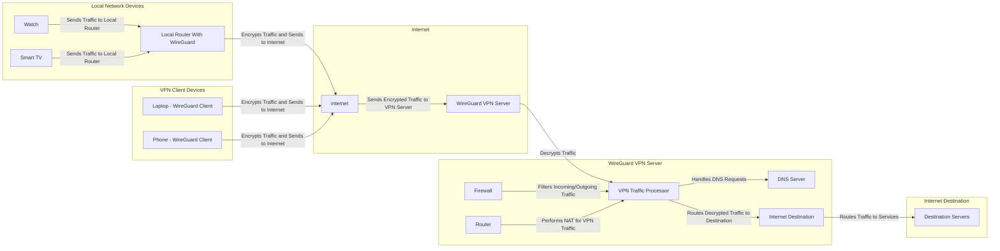

# WireGuard-Manager: Secure Your Network 💻 🖥!

## 🔰 Introduction

Welcome to WireGuard-Manager, your solution for setting up WireGuard, a cutting-edge VPN protocol. WireGuard is known for its speed, security, and ease of use, making it an ideal choice for both personal and professional VPN needs. This tool is designed to simplify the installation and management of WireGuard, ensuring a secure and efficient networking experience.

## Quality and Reliability

### Project Information and Status

- **Latest Releases**: Stay on top of our newest versions:
  [](https://github.com/complexorganizations/wireguard-manager/releases/latest)

- **Monthly App Release**: Track our regular monthly releases:
  [](https://github.com/complexorganizations/wireguard-manager/actions/workflows/monthly-application-release.yml)

### Build Statuses

- **Code Quality Assurance**: Verified by ShellCheck for reliability:
  [](https://github.com/complexorganizations/wireguard-manager/actions/workflows/shell-check-wireguard-manager.yml)

- **Blocked Hosts**: Monitor the status of blocked host updates:
  [](https://github.com/complexorganizations/wireguard-manager/actions/workflows/auto-update-blocked-hosts.yaml)

- **Named Cache**: Check updates for named cache:
  [](https://github.com/complexorganizations/wireguard-manager/actions/workflows/auto-update-named-cache.yml)

- **Software Updates**: Keep track of the latest software builds:
  [](https://github.com/complexorganizations/wireguard-manager/actions/workflows/build-latest-version.yml)

### Contribution and Issues

- **Open Issues Tracking**: View and address current open issues:
  [](https://github.com/complexorganizations/wireguard-manager/issues)

- **Contribution Opportunities**: Dive into open pull requests and contribute:
  [](https://github.com/complexorganizations/wireguard-manager/pulls)

### Licensing

- **Project License**: Our work is under the Apache 2.0 License:
  [](https://github.com/complexorganizations/wireguard-manager/blob/main/license.md)

## 📢 Support

We understand that setting up and managing a WireGuard VPN can sometimes be challenging, especially if you’re new to Linux or networking. That’s why we’re here to help!

### 💬 Join Our Discord Community

For support, guidance, or just to chat with like-minded individuals, join our friendly Discord server:  
[**Join us on Discord**](https://discord.gg/WwNCxCcE)

#### What You Can Expect

Our Discord is the go-to place for:

- **Quick Assistance**: Get real-time help for any issues related to WireGuard or Linux.
- **Expert Advice**: Receive tips and recommendations from experienced users and developers.
- **Learning Opportunities**: Expand your knowledge of Linux, VPNs, and networking.
- **Community Support**: Engage with a welcoming community that’s eager to help.

#### Topics We Cover

- Troubleshooting WireGuard setup and configurations.
- Optimizing VPN performance and security.
- Learning the basics (and advanced aspects) of Linux.
- Understanding networking concepts and practices.

Whether you’re stuck on a command, confused by a configuration, or just need advice, our team and community are here for you.

### 🛠 How to Reach Us

- **Discord**: [**Click here to join**](https://discord.gg/WwNCxCcE)
- **Open an Issue**: If your question is specific to this project, consider opening an issue directly in this repository.

We’re committed to making sure you have the support you need to succeed with WireGuard and Linux!

## ✊ Show Your Support

If you've found this project useful, please consider giving it a star and forking it. Your support is greatly appreciated!

## 🤷 What is VPN?

A Virtual Private Network (VPN) allows users to send and receive data through shared or public networks as if their computing devices were directly connected to the private network. Thus, applications running on an end-system (PC, smartphone, etc.) over a VPN may benefit from individual network features, protection, and management. Encryption is a standard aspect of a VPN connection but not an intrinsic one.

## 📶 What is WireGuard?

WireGuard is a straightforward yet fast and modern VPN that utilizes state-of-the-art cryptography. It aims to be faster, simpler, leaner, and more useful than IPsec while avoiding the massive headache. It intends to be considerably more performant than OpenVPN. WireGuard is designed as a general-purpose VPN for running on embedded interfaces and super computers alike, fit for many circumstances. Initially released for the Linux kernel, it is now cross-platform (Windows, macOS, BSD, iOS, Android) and widely deployable. It is currently under a massive development, but it already might be regarded as the most secure, most comfortable to use, and the simplest VPN solution in the industry.

## Why WireGuard-Manager?

- **Security First**: With top-notch encryption and privacy features.
- **User-Friendly**: Easy to install and manage, regardless of your tech-savviness.
- **High Performance**: Enjoy fast and reliable connections.
- **Open Source**: Built and improved by the community.

## ⛳ Goals

- Robust and modern security as a standard.
- Minimal configuration with essential management tools.
- Optimal performance for both low-latency and high-bandwidth operations.
- Simplified command-line interface for easy integration with system networking.

## 🌲 Prerequisite

- Supported on a variety of systems including Alma, Alpine, Arch, CentOS, Debian, Fedora, FreeBSD, Kali, Mint, Manjaro, Neon, Oracle, Pop, Raspbian, RHEL, Rocky, Ubuntu, and more.
- Requires Linux Kernel 3.1 or newer.
- Superuser access or a user account with `sudo` privileges is necessary.

## 🚦 Getting Started

1. **Installation**: Simple and quick installation process.
2. **Configuration**: Easy-to-follow configuration steps.
3. **Management**: User-friendly interface for managing your VPN.

## Installation Guide

[](https://youtu.be/inRir_AGsKQ)

## 🐧 Installation

To ensure the successful installation of the WireGuard Manager script on various Linux systems, it's crucial to have `curl` and `bash` installed. Here's an expanded installation guide that includes instructions for installing `curl` and `bash` on different Linux distributions:

### Installing `curl` & `bash` & `resolvconf` on Linux Systems

#### Debian/Ubuntu-based Systems (e.g., Ubuntu, Debian, Linux Mint):

```bash
sudo apt update
sudo apt install curl bash resolvconf
```

#### Red Hat-based Systems (e.g., CentOS, RHEL, Fedora):

```bash
sudo yum install curl bash resolvconf
```

or

```bash
sudo dnf install curl bash resolvconf
```

#### Arch-based Systems (e.g., Arch Linux, Manjaro):

```bash
sudo pacman -Sy curl bash resolvconf
```

#### Alpine Linux:

```bash
sudo apk update
sudo apk add curl bash resolvconf
```

#### Other Distributions:

For other Linux distributions, you can use the package manager specific to that distribution to install `curl` & `bash` & `resolvconf`. The package names may vary slightly.

### Installing WireGuard Manager Script

Now that you have `curl` and `bash` installed, you can proceed with installing the WireGuard Manager script using the provided instructions:

1. First, use `curl` to download the script and save it in `/usr/local/bin/`:

   ```bash
   curl https://raw.githubusercontent.com/Strong-Foundation/wireguard-manager/main/wireguard-manager.sh --create-dirs -o /usr/local/bin/wireguard-manager.sh
   ```

2. Next, make the script user executable:

   ```bash
   chmod +x /usr/local/bin/wireguard-manager.sh
   ```

3. Finally, execute the script:

   ```bash
   bash /usr/local/bin/wireguard-manager.sh
   ```

### Connecting to WireGuard Interface

In your `/etc/wireguard/clients` directory, you will find `.conf` files. These are the peer configuration files. Download them from your WireGuard Interface and connect using your favorite WireGuard Peer.

## 🔑 Usage

```md
usage: bash /usr/local/bin/wireguard-manager.sh # --install
--install Installs the WireGuard interface on your system
--start Starts the WireGuard interface if it's not already running
--stop Stops the WireGuard interface if it's currently running
--restart Restarts the WireGuard interface
--list Lists all the peers currently connected to the WireGuard interface
--add Adds a new peer to the WireGuard interface
--remove Removes a specified peer from the WireGuard interface
--reinstall Reinstalls the WireGuard interface, keeping the current configuration
--uninstall Uninstalls the WireGuard interface from your system
--update Updates the WireGuard Manager to the latest version
--ddns Updates the IP address of the WireGuard interface using Dynamic DNS
--backup Creates a backup of your current WireGuard configuration
--restore Restores the WireGuard configuration from a previous backup
--purge Removes all peers from the WireGuard interface
--help Displays this usage guide
```

## 🥰 Features

- Seamless installation and configuration of WireGuard Interface
- Convenient backup and restoration of WireGuard
- Automatic expiration of peer configurations
- Support for both IPv4 and IPv6, with leak protection
- Variety of public DNS options available for peers
- Option to use a self-hosted resolver with Unbound for DNS leak prevention and DNSSEC support
- Effortless management of Nftables rules and forwarding
- Easy removal and uninstallation of WireGuard Interface
- Mandatory preshared-key for an additional layer of security
- Numerous other minor features for enhanced user experience

## 💡 Configuration Options

- `PRIVATE_SUBNET_V4_SETTINGS`: This defines the private IPv4 subnet used within the VPN. The default is `10.0.0.0/8`, a standard private IP range.
- `PRIVATE_SUBNET_V6_SETTINGS`: This sets the private IPv6 subnet. The default `fd00:00:00::0/8` is a typical private IPv6 range.
- `SERVER_HOST_V4_SETTINGS`: This is used to detect the public IPv4 address of the server, crucial for establishing connections from outside the local network.
- `SERVER_HOST_V6_SETTINGS`: This is the IPv6 counterpart to the previous setting, used for detecting the server's public IPv6 address.
- `SERVER_PUB_NIC_SETTINGS`: This determines the local public network interface using the `ip` command, essential for server communication on the public network.
- `SERVER_PORT_SETTINGS`: This specifies the default public port (`51820`) for the WireGuard interface, the port through which VPN traffic will pass.
- `NAT_CHOICE_SETTINGS`: This configures the use of the VPN tunnel's keep-alive feature, which helps keep the connection active.
- `MTU_CHOICE_SETTINGS`: This sets the Maximum Transmission Unit (MTU) for WireGuard peers, impacting the size of packets transmitted over the network.
- `SERVER_HOST_SETTINGS`: This is a general setting for defining server-specific configurations.
- `CLIENT_ALLOWED_IP_SETTINGS`: This defines the IP range allowed for clients connecting to the VPN, restricting which devices can connect.
- `AUTOMATIC_UPDATES_SETTINGS`: This likely relates to whether the system will automatically update software or configurations.
- `AUTOMATIC_BACKUP_SETTINGS`: This pertains to the automatic backup of system configurations or data.
- `DNS_PROVIDER_SETTINGS`: This involves setting up a DNS provider for the network. If you're not using Unbound, you'll need to specify another DNS service.
- `CONTENT_BLOCKER_SETTINGS`: This might relate to settings for blocking certain types of content through the network.
- `CLIENT_NAME`: This is the name assigned to a WireGuard peer (client) in the VPN.
- `AUTOMATIC_CONFIG_REMOVER`: This is possibly a setting to automatically remove certain configurations after they are no longer needed or after a set period.

## 👉👈 Compatibility with Linux Distributions

| Operating System    | i386 Support | amd64 Support | armhf Support | arm64 Support |
| ------------------- | ------------ | ------------- | ------------- | ------------- |
| Ubuntu 14 and below | No           | No            | No            | No            |
| Ubuntu 16 and above | Yes          | Yes           | Yes           | Yes           |
| Debian 7 and below  | No           | No            | No            | No            |
| Debian 8 and above  | Yes          | Yes           | Yes           | Yes           |
| CentOS 6 and below  | No           | No            | No            | No            |
| CentOS 7 and above  | Yes          | Yes           | Yes           | Yes           |
| Fedora 29 and below | No           | No            | No            | No            |
| Fedora 30 and above | Yes          | Yes           | Yes           | Yes           |
| RedHat 6 and below  | No           | No            | No            | No            |
| RedHat 7 and above  | Yes          | Yes           | Yes           | Yes           |
| Kali 1.0 and below  | No           | No            | No            | No            |
| Kali 1.1 and above  | Yes          | Yes           | Yes           | Yes           |
| Arch Linux          | Yes          | Yes           | Yes           | Yes           |
| Raspbian            | Yes          | Yes           | Yes           | Yes           |
| PopOS               | Yes          | Yes           | Yes           | Yes           |
| Manjaro             | Yes          | Yes           | Yes           | Yes           |
| Mint                | Yes          | Yes           | Yes           | Yes           |
| AlmaLinux           | Yes          | Yes           | Yes           | Yes           |
| Alpine              | Yes          | Yes           | Yes           | Yes           |
| FreeBSD             | Yes          | Yes           | Yes           | Yes           |
| KDE Neon            | Yes          | Yes           | Yes           | Yes           |
| Rocky Linux         | Yes          | Yes           | Yes           | Yes           |
| Oracle Linux        | Yes          | Yes           | Yes           | Yes           |

## ☁️ Compatibility with Cloud Providers

| Cloud           | Supported |
| --------------- | --------- |
| AWS             | Yes       |
| Google Cloud    | Yes       |
| Linode          | Yes       |
| Digital Ocean   | Yes       |
| Vultr           | Yes       |
| Microsoft Azure | Yes       |
| OpenStack       | Yes       |
| Rackspace       | Yes       |
| Scaleway        | Yes       |
| EuroVPS         | Yes       |
| Hetzner Cloud   | No        |
| Strato          | No        |

## 🛡️ Compatibility with Virtualization

| Virtualization | Supported |
| -------------- | --------- |
| KVM            | Yes       |
| None           | Yes       |
| Qemu           | Yes       |
| LXC            | Yes       |
| Microsoft      | Yes       |
| Vmware         | Yes       |
| OpenVZ         | No        |
| Docker         | No        |
| WSL            | No        |

## 💻 Compatibility with Linux Kernel

| Kernel                     | Compatibility |
| -------------------------- | ------------- |
| Linux Kernel 3.0 and below | No            |
| Linux Kernel 3.1 and above | Yes           |

## 🙋 Frequently Asked Questions

**Which hosting providers do you recommend?**

- **Google Cloud**: Provides global locations and IPv4 support, with prices starting at $3.50/month. [Visit Google Cloud](https://cloud.google.com)
- **Amazon Web Services (AWS)**: Offers global locations and IPv4 support, with plans starting from $5.00/month. [Visit AWS](https://aws.amazon.com)
- **Microsoft Azure**: Features worldwide locations and IPv4 support, with plans beginning at $5.00/month. [Visit Azure](https://azure.microsoft.com)
- **Linode**: Includes global locations, supports both IPv4 & IPv6, starting at $5.00/month. [Visit Linode](https://www.linode.com)
- **Vultr**: Provides worldwide locations, supports IPv4 & IPv6, with prices starting at $3.50/month. [Visit Vultr](https://www.vultr.com)

**Which WireGuard clients do you recommend?**

- **Windows**: You can download WireGuard from their [official website](https://www.wireguard.com/install).
- **Android**: WireGuard is available on the [Google Play Store](https://play.google.com/store/apps/details?id=com.wireguard.android).
- **macOS**: You can download WireGuard from the [Mac App Store](https://itunes.apple.com/us/app/wireguard/id1451685025).
- **iOS**: WireGuard is available on the [App Store](https://itunes.apple.com/us/app/wireguard/id1441195209).

## Additional Information

**Where can I access comprehensive WireGuard documentation?**

- The [WireGuard Manual](https://www.wireguard.com) provides detailed information on all available options.

**How can I install WireGuard without interactive prompts for a headless installation?**

- Execute the command: `./wireguard-manager.sh --install`

**Are there any alternatives to self-hosting a VPN?**

- Yes, [CloudFlare Warp](https://1.1.1.1) is a viable alternative.

**Why is all the code centralized in one place?**

- Consider it like a universal remote: it's more efficient to have a single device (or codebase) that performs all functions than having multiple specialized ones.

**Which port and protocol does WireGuard require?**

- You need to forward your chosen port or the default port `51820` using the UDP protocol.

**Do I need to forward any ports for Unbound?**

- No, port forwarding isn't necessary for Unbound as DNS traffic is routed through the VPN (`port 53`).

**What does the content blocker restrict?**

- The content blocker restricts ads, trackers, malware, and phishing attempts.

**What information is collected and how is it used?**

- No logs or data are collected or retained. All operations are performed within the system, with no external log transmission.

## Setting Up Your Own VPN Server

To set up your own VPN server, you will need the following items:

### **Raspberry Pi 5 VPN Setup Components**

To set up a Raspberry Pi 5 as a VPN server or client, you will need the following components:

#### **1. Raspberry Pi 5**

- **Key Features:** Quad-core ARM Cortex-A76, up to 8GB RAM, dual 4K HDMI, USB 3.0, and Gigabit Ethernet.
- **[View Product](https://www.raspberrypi.com/products/raspberry-pi-5/)**

#### **2. Raspberry Pi Case**

- **Key Features:** Custom fit with passive cooling for the Raspberry Pi 5, helps with heat management.
- **[View Product](https://www.raspberrypi.com/products/raspberry-pi-5-case/)**

#### **3. Raspberry Pi Active Cooler**

- **Key Features:** Active cooling with a quiet fan, essential for extended VPN use.
- **[View Product](https://www.raspberrypi.com/products/active-cooler)**

#### **4. Raspberry Pi USB-C Power Supply**

- **Key Features:** 5V/3A, ensures stable power for continuous VPN operation.
- **[View Product](https://www.raspberrypi.com/products/27w-power-supply/)**

#### **5. Micro SD Card**

- **Key Features:** High-speed UHS-I card (32GB or higher recommended), stores OS and VPN configurations.
- **[View on Amazon](https://www.amazon.com/dp/B06XWMQ81P)**

#### **6. Ethernet Cable**

- **Key Features:** Gigabit Ethernet for fast, reliable connection to the internet and local network.
- **[View on Amazon](https://www.amazon.com/dp/B00N2VIALK)**

#### **7. SD Card Reader**

- **Key Features:** High-speed transfer for setting up the Raspberry Pi OS and VPN software.
- **[View on Amazon](https://www.amazon.com/dp/B0957HQ4D1)**

---

### **Additional Components for VPN Setup**

#### **8. USB Wi-Fi Adapter** (Optional)

- **Key Features:** If you're setting up a wireless VPN server, a compatible USB Wi-Fi adapter is needed for wireless connectivity.
- **[View on Amazon](https://www.amazon.com/dp/B08T5C76F2)**

#### **9. External Hard Drive/SSD** (Optional)

- **Key Features:** For storing large amounts of VPN logs or data, an external drive provides more storage.
- **[View on Amazon](https://www.amazon.com/dp/B08PCFFCLP)**

#### **10. VPN Configuration Files**

- **Key Features:** Pre-configured VPN client/server files for easy setup. These include configuration files for WireGuard or OpenVPN.
- **Download for WireGuard:** [WireGuard Downloads](https://www.wireguard.com/install/)
- **Download for OpenVPN:** [OpenVPN Downloads](https://openvpn.net/community-downloads/)

#### **11. Static IP Address** (Optional)

- **Key Features:** For remote VPN access, a static IP address (or dynamic DNS) ensures consistent connectivity to your Raspberry Pi.
- **[Learn More about Dynamic DNS](https://www.noip.com/)**

#### **12. Router Port Forwarding**

- **Key Features:** Forwarding ports (e.g., UDP port 51820 for WireGuard or UDP 1194 for OpenVPN) on your router is necessary for external access to your VPN.
- **[Learn How to Port Forward](https://www.portforward.com/)**

#### **13. USB Keyboard and Mouse**

- **Key Features:** Required for initial setup and configuration of the Raspberry Pi via the desktop interface.
- **[View on Amazon](https://www.amazon.com/dp/B08BLR5S4G)**

#### **14. Monitor/HDMI Cable**

- **Key Features:** If you’re doing the setup directly on the Raspberry Pi, a monitor and HDMI cable will be required to interact with the GUI.
- **[View on Amazon](https://www.amazon.com/dp/B0855T1W4Q)**

---

### **Optional Software and Tools**

- **WireGuard or OpenVPN Software**

  - WireGuard or OpenVPN can be installed for secure, high-performance VPN connections. Use the Raspberry Pi terminal to install them via commands.

- **Dynamic DNS Service**
  - Useful for giving your Raspberry Pi a consistent hostname to connect to, especially if your external IP address changes frequently.

### Estimated Cost for Building Your Own VPN

- The estimated one-time hardware cost is around $100 USD. Please note that there will be ongoing costs for electricity and internet.

## WireGuard Resources

- Homepage: [WireGuard Official Site](https://www.wireguard.com)
- Installation Guide: [Install WireGuard](https://www.wireguard.com/install/)
- Quick Start: [WireGuard QuickStart](https://www.wireguard.com/quickstart/)
- Compilation Instructions: [Compile WireGuard](https://www.wireguard.com/compilation/)
- Whitepaper: [WireGuard Whitepaper](https://www.wireguard.com/papers/wireguard.pdf)

## VPN Speed Comparison

This section compares the internet speed differences between using no VPN, WireGuard, and OpenVPN.

### No VPN (Normal Connection)


### WireGuard Speed Test


### OpenVPN Speed Test


## 🙅 Content-Blocking vs. No Content-Blocking

[](https://youtube.com/shorts/GHD7Et2_3ho)

## 📐 Architecture



## 🤝 Code Development

**Develop Code Without Cloning the Repository**

You can directly work on the code without the need to clone the repository. This is facilitated by Visual Studio Code's online platform. By clicking the link below, you can preview and edit the code in your browser, leveraging the intuitive interface of Visual Studio Code. This method streamlines the development process, particularly for those who want to make quick modifications or do not wish to set up the entire repository on their local machine.

[](https://open.vscode.dev/complexorganizations/wireguard-manager)

## 🐛 Code Debugging

**Detailed Debugging Process After Cloning the Repository**

For a comprehensive debugging process, you might want to clone the repository to your local system. This method allows you to thoroughly test and debug the code in your environment. Follow these steps to clone the repository and start the debugging process:

1. **Clone the Repository**: Use the Git command to clone the repository to your preferred directory, such as `/root/` in this example. This step copies all the code from the online repository to your local machine.

```bash
git clone https://github.com/complexorganizations/wireguard-manager /root/wireguard-manager
```

2. **Start Debugging**: After cloning, navigate to the script's directory and initiate the debugging process. The script will be executed in debug mode, providing detailed output of each step. This output is redirected to a log file for easier examination. The log file, located in the same directory, stores all the debugging information, making it easy to trace any issues or understand the script's behavior.

```bash
bash -x /root/wireguard-manager/wireguard-manager.sh >>/root/wireguard-manager/wireguard-manager.log
```

Following these steps, you can either quickly modify the code online without cloning or perform a more comprehensive debugging process by cloning the repository to your local machine. Each method offers different benefits depending on your needs and the extent of your work with the WireGuard Manager script.

### Detailed Debugging Guide for WireGuard Manager

1. **Setting Up the Environment**

   - Ensure that all necessary software, including Git, Bash, and any dependencies required by WireGuard Manager, are installed on your system.
   - While Visual Studio Code is used in this example, you can use any IDE that supports Git and Bash.

2. **Cloning the Repository**

   - Use Git to clone the WireGuard Manager repository to a local directory: `git clone https://github.com/complexorganizations/wireguard-manager /path/to/local-directory`
   - Avoid using root directories for development. Choose a user directory for better safety and permission management.

3. **Understanding the Codebase**

   - Review the code to understand its structure, conventions, and documentation.
   - Check for a README file or wiki pages in the repository that might provide insights into the codebase.

4. **Setting Up Debugging Tools**

   - Configure the debugging tools in your IDE. Set breakpoints, watch variables, and use step-through debugging features.
   - Ensure that logging is correctly set up in the script to capture sufficient details for debugging.

5. **Running the Script in Debug Mode**

   - Run the script with `bash -x` to get detailed trace outputs: `bash -x /path/to/local-directory/wireguard-manager/wireguard-manager.sh >> /path/to/local-directory/wireguard-manager.log`
   - Regularly check the log file for errors or unexpected behavior.

6. **Testing in Different Environments**

   - Test the script in isolated environments like Docker containers or VMs to understand its behavior in different settings.
   - If possible, test on different operating systems to ensure compatibility.

7. **Collaborating and Seeking Feedback**

   - Commit changes to a new branch and use pull requests for reviews.
   - Request code reviews from peers to get different perspectives on potential issues.

8. **Documenting Your Findings**

   - If you discover undocumented behavior or fixes, update the project documentation.
   - Use the repository's issue tracker to report bugs or suggest enhancements.

9. **Automating Testing**

   - Create automated tests for critical functionalities to catch bugs early.
   - Use CI tools to automate testing with every commit or pull request.

10. **Staying Updated with the Repository**
    - Regularly update your local repository with changes from the main project to stay in sync and avoid conflicts.

By following these steps and adapting them to their own development environment and workflow, developers can more effectively debug and contribute to the WireGuard Manager project. This comprehensive approach caters to various skill levels and preferences, thereby facilitating a more inclusive and efficient development process.

## 💋 Acknowledgements

This project is made possible thanks to the Open Source Community.

## 📱 Community and Contributions

Join our community on [](https://discord.gg/WwNCxCcE) to contribute to the project, share ideas, and get help.

## 🤝 Sponsors

This project is sponsored by

[](https://www.digitalocean.com) [](https://cloud.google.com) [](https://aws.amazon.com) [](https://linode.com)

## 📝 License

WireGuard-Manager is licensed under the Apache License Version 2.0. For more details, please refer to our [License File](https://github.com/complexorganizations/wireguard-manager/blob/main/license.md).
