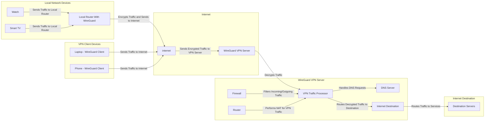

```mermaid
graph LR
  %% VPN Client Devices (Direct Connection)
  subgraph "VPN Client Devices"
    phone[Phone - WireGuard Client]
    laptop[Laptop - WireGuard Client]
  end

  %% Local Network Devices Connecting Through Router
  subgraph "Local Network Devices"
    localWatch[Watch] -->|Sends Traffic to Local Router| localRouter[Local Router With WireGuard]
    localSmartTV[Smart TV] -->|Sends Traffic to Local Router| localRouter
    localRouter
  end

  %% Internet Block
  subgraph "Internet"
    internet -->|"Sends Encrypted Traffic to VPN Server"| vpnServer[WireGuard VPN Server]
  end

  %% WireGuard VPN Server - Processing Encrypted Traffic
  subgraph "WireGuard VPN Server"
    vpnServer -->|Decrypts Traffic| wireGuardVPN[VPN Traffic Processor]
    wireGuardVPN -->|Handles DNS Requests| dnsServer[DNS Server]
    firewall[Firewall] -->|Filters Incoming/Outgoing Traffic| wireGuardVPN
    router[Router] -->|Performs NAT for VPN Traffic| wireGuardVPN
    wireGuardVPN -->|Routes Decrypted Traffic to Destination| internetDestination["Internet Destination"]
  end

  %% Internet Destination - Services Handling Requests
  subgraph "Internet Destination"
    internetDestination -->|Routes Traffic to Services| destinationServices[Destination Servers]
  end

  %% Connections to the Internet
  internet
  vpnServer
  localRouter -->|"Encrypts Traffic and Sends to Internet"| internet
  laptop -->|"Sends Traffic to Internet"| internet
  phone -->|"Sends Traffic to Internet"| internet

```
