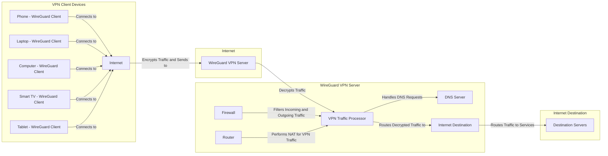

```mermaid
graph LR
  %% VPN Client Devices
  subgraph "VPN Client Devices"
    phone[Phone - WireGuard Client] -->|Connects to| internet["Internet"]
    laptop[Laptop - WireGuard Client] -->|Connects to| internet
    computer[Computer - WireGuard Client] -->|Connects to| internet
    smartTV[Smart TV - WireGuard Client] -->|Connects to| internet
    tablet[Tablet - WireGuard Client] -->|Connects to| internet
  end

  %% Internet Layer
  subgraph "Internet"
    internet -->|Encrypts Traffic and Sends to| vpnServer[WireGuard VPN Server]
  end

  %% WireGuard VPN Server
  subgraph "WireGuard VPN Server"
    vpnServer -->|Decrypts Traffic| wireGuardVPN[VPN Traffic Processor]
    wireGuardVPN -->|Handles DNS Requests| dnsServer[DNS Server]
    firewall[Firewall] -->|Filters Incoming and Outgoing Traffic| wireGuardVPN
    router[Router] -->|Performs NAT for VPN Traffic| wireGuardVPN
    wireGuardVPN -->|Routes Decrypted Traffic to| internetDestination["Internet Destination"]
  end

  %% Internet Destination
  subgraph "Internet Destination"
    internetDestination -->|Routes Traffic to Services| destinationServices[Destination Servers]
  end

```
