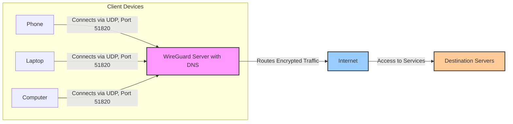

```mermaid
graph LR
  subgraph Client Devices
    A[Phone] -->|Connects via UDP, Port 51820| VPN
    B[Laptop] -->|Connects via UDP, Port 51820| VPN
    C[Computer] -->|Connects via UDP, Port 51820| VPN
  end

  VPN[WireGuard Server with DNS]:::server

  VPN -->|Routes Encrypted Traffic| I[Internet]:::internet

  I -->|Access to Services| D[Destination Servers]:::services

  classDef server fill:#f9f,stroke:#333,stroke-width:2px;
  classDef internet fill:#9cf,stroke:#333,stroke-width:2px;
  classDef services fill:#fc9,stroke:#333,stroke-width:2px;
```
